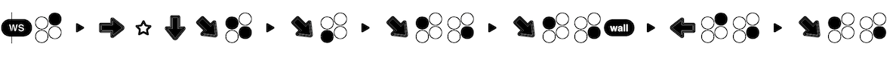

# Tekken Font

Font for displaying Tekken notation graphically

## Building

Download and install [Node.js](https://nodejs.org/).

```
$ npm i
$ npm run build
```

## Reference

[http://www.tekkenzaibatsu.com/legend.php](http://www.tekkenzaibatsu.com/legend.php)

## Example

`WS 2 , f N d d/f 1+4 , d/f 3 , d/f 1 4 , d/f 1 4 W! , b 2 4 , d/f 1 4`

becomes




## To do

- Add ligatures for:
    - optional commands
    - slide
    - delayed input
    - Next in Sequence
    - Tap and Hold Button
    - Requires Just Frame Input
    - Character specific moves (ie. Kazuya's EWGF, etc.)
- Alternate variations of ligatures
- Write a script for generating badges more easily